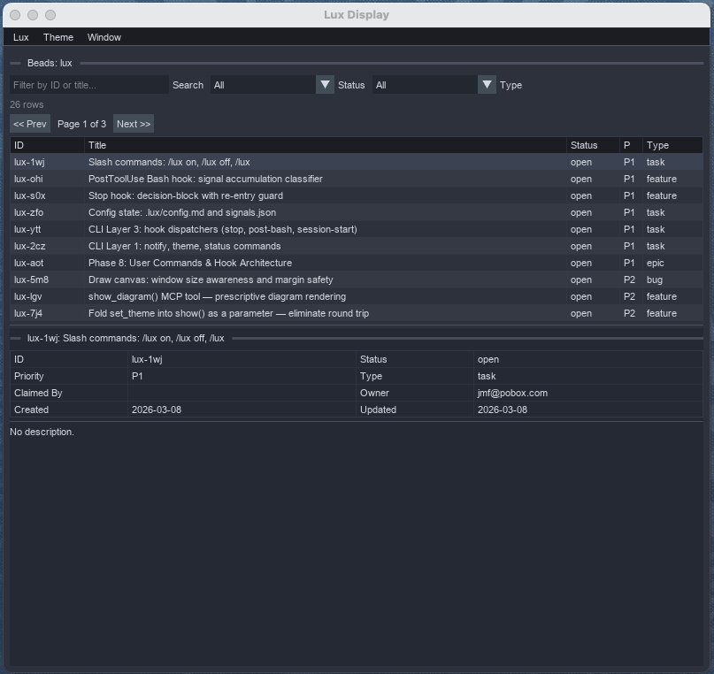
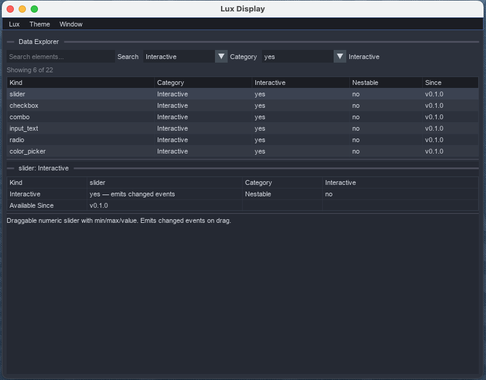

# lux

> A visual output surface for AI agents.

[](LICENSE)
[](https://github.com/punt-labs/lux/actions/workflows/test.yml)
[](https://pypi.org/project/punt-lux/)
[](https://pypi.org/project/punt-lux/)
[](prfaq.pdf)

Lux gives agents and apps a shared visual surface. The intended architecture is a hub/display split: clients send UI descriptions to `luxd`, the Hub owns authoritative element state and behavior, and the Display renders a replica of the current scene while forwarding user interactions back to the Hub.

The design draws on X11's client/server split and Smalltalk-style live introspection. MCP is one gateway into Lux, not the whole architecture. If you want the short version of the rewrite target, start with [`docs/architecture/target/target.md`](docs/architecture/target/target.md). If you need help navigating the docs, use [`docs/README.md`](docs/README.md). For the product direction, positioning, and risk assessment — the Working Backwards PR/FAQ — see [`prfaq.pdf`](prfaq.pdf).

**Platforms:** macOS, Linux

**Stage:** alpha --- protocol is stable, published on PyPI as `punt-lux`

*A Claude Code plugin displaying a project issue board --- the agent fetches live data from DoltDB via `bd list --json`, builds a filterable table with detail panel, and renders it in a single tool call. Filters and row selection run at 60fps with zero MCP round-trips.*



*The same list/detail pattern generalizes to any tabular data. Search, combo filters, pagination, and a detail panel --- all driven by a single `show_table()` call.*



*Dashboards compose metric cards, charts, and tables. `show_dashboard()` builds the layout from structured data --- no manual element positioning needed.*


## Quick Start

```bash
curl -fsSL https://raw.githubusercontent.com/punt-labs/lux/947e89a/install.sh | sh
```

Restart Claude Code twice. The Lux display window opens automatically when agents send visual output.

<details>
<summary>Manual install (if you already have uv)</summary>

```bash
uv tool install 'punt-lux[display]'
```

Then install the plugin via the marketplace:

```bash
claude plugin marketplace add punt-labs/claude-plugins
claude plugin install lux@punt-labs
```

</details>

<details>
<summary>Lightweight install (CLI and protocol types, no renderer)</summary>

If you only need the `lux` CLI and the JSON protocol element types --- enough to
drive a running luxd over its REST API and to build element trees in Python
--- install the base package:

```bash
uv add punt-lux
```

This pulls ~2 MB of lightweight deps. The 66 MB display stack (imgui-bundle, numpy, Pillow, PyOpenGL) is only needed to run the renderer (`lux display`) and is available via `punt-lux[display]`.

</details>

<details>
<summary>Verify before running</summary>

```bash
curl -fsSL https://raw.githubusercontent.com/punt-labs/lux/947e89a/install.sh -o install.sh
shasum -a 256 install.sh
cat install.sh
sh install.sh
```

</details>

<details>
<summary>Run a demo</summary>

```bash
lux display &
uv run python demos/dashboard.py
```

Demos are in `demos/` --- each connects as a client and drives the display:

| Demo | What it shows |
|------|--------------|
| `interactive.py` | Sliders, checkboxes, combos, text inputs, color pickers |
| `containers.py` | Windows, tab bars, collapsing headers, groups |
| `dashboard.py` | Multi-window layout with draw canvases and live controls |
| `data_viz.py` | Tables, plots, progress bars, spinners, markdown |
| `menu_bar.py` | Custom menus, event handling, periodic refresh |

</details>

## Features

- **25 element kinds** --- text, buttons (arrow, small), images, sliders, checkboxes, combos, inputs (text, number), radios, color pickers (alpha, full picker), selectables, trees, tables, plots, progress bars, spinners, markdown, draw canvases, modals, dialogs, groups, tab bars, collapsing headers, windows, separators
- **Frames** --- scenes target named frames (inner windows) via `frame_id`. Frames persist after disconnect, can be adopted by new clients, and support initial sizing (`frame_size`) and ImGui window flags (`frame_flags`)
- **Layout nesting** --- windows contain tab bars contain groups contain any element, arbitrarily deep
- **Incremental updates** --- `update` patches individual elements by ID without replacing the scene
- **World menu** --- per-client namespaced menus. Each connected MCP server gets its own submenu. Items registered via `register_tool` are routed only to the owning client
- **Interaction handling** --- button clicks, slider changes, and menu clicks fire their handlers on the Hub (D21 remote dispatch); the raw event log is readable via `list_recent_events`. Hub handlers can `publish` app events that the agent reads via `recv`
- **Frame auto-focus** --- frames automatically focus (brought to front) when they receive a scene update
- **Persistent tabs** --- each `show()` call opens a dismissable tab; same `scene_id` replaces content in-place. Users can close individual tabs
- **Themes** --- 11 themes via `set_theme`: `imgui_colors_dark`, `imgui_colors_light`, `imgui_colors_classic`, `darcula`, `darcula_darker`, `material_flat`, `photoshop_style`, `grey_flat`, `cherry`, `light_rounded`, `microsoft_style`
- **Auto-spawn** --- the Hub (luxd) starts the display renderer on first use if it isn't already running
- **Unix socket IPC** --- length-prefixed JSON frames, no HTTP overhead, no threads

## MCP Tools

Agents interact with Lux through **27 MCP tools** that `luxd` serves over its streamable-HTTP `/mcp` endpoint:

| Tool | What it does |
|------|-------------|
| **Scene management** | |
| `show(scene_id, elements)` | Replace the display with a new element tree. Supports `frame_id`, `frame_size`, `frame_flags` for windowed frames |
| `show_table(scene_id, columns, rows)` | Display a filterable data table with optional detail panel |
| `show_dashboard(scene_id, ...)` | Display a dashboard with metric cards, charts, and a table |
| `update(scene_id, patches)` | Patch elements by ID (set fields or remove) |
| `clear()` | Remove all content from the display |
| **Communication** | |
| `ping()` | Round-trip latency check |
| `recv()` | Take the next queued app event for this session (pub/sub) without blocking; returns `event:<topic>:<payload>` or `none` immediately. Poll on your own schedule. UI interactions are handled Hub-side, not delivered here |
| `set_menu(menus)` | Add custom menus to the menu bar |
| `register_tool(id, label)` | Register a World menu item routed only to the calling server via `recv()` |
| `set_theme(theme)` | Switch display theme |
| **Configuration** | |
| `display_mode(repo)` | Read current display mode (`y`/`n`) for the caller's project --- pass the absolute project path |
| `set_display_mode(mode, repo)` | Set display mode for the caller's project --- pass the absolute project path |
| `set_window_settings(...)` | Configure opacity, font scale, decoration, idle FPS |
| `set_frame_state(frame_id, ...)` | Minimize or restore a frame |
| **Introspection** | |
| `inspect_scene(scene_id)` | Return element tree for a scene |
| `list_scenes()` | List all active scenes with metadata |
| `screenshot()` | Capture display as base64 PNG |
| `get_display_info()` | Display dimensions, frame count, client count |
| `get_window_settings()` | Current window configuration |
| `get_theme()` | Current theme name |
| `list_clients()` | Connected clients with names and scene counts |
| `list_menus()` | Registered menu items |
| `list_recent_events(count)` | Recent interaction events |
| `list_errors(count)` | Recent error log entries |
| **Pub/Sub (Agent Subscribe)** | |
| `subscribe(topic)` | Subscribe to a Hub-scoped app topic; delivered via `recv` |
| `unsubscribe(topic)` | Stop receiving a topic |
| `publish(topic, payload)` | Publish an app event to a Hub topic (separate from the UI observer mechanism) |

## What It Looks Like

### Show text and a button

```json
{"tool": "show", "input": {
  "scene_id": "hello",
  "elements": [
    {"kind": "text", "id": "t1", "content": "Hello from the agent"},
    {"kind": "button", "id": "b1", "label": "Click me"}
  ]
}}
```

Returns `"shown:hello"` immediately — the Hub has accepted the scene and its
background replicator paints it; no tool call ever waits on the display. A
button click fires its handler on the Hub (the agent does not poll for it). To observe interactions, read the introspection log:

```json
{"tool": "list_recent_events", "input": {"count": 5}}
```

A Hub-side handler can `publish` an app event that the agent then reads with
`recv` (see the Pub/Sub tools above).

### Multi-window dashboard

```json
{"tool": "show", "input": {
  "scene_id": "dash",
  "elements": [
    {"kind": "window", "id": "w1", "title": "Controls", "x": 10, "y": 10,
     "children": [
       {"kind": "slider", "id": "vol", "label": "Volume", "value": 50}
     ]},
    {"kind": "window", "id": "w2", "title": "Chart", "x": 320, "y": 10,
     "children": [
       {"kind": "plot", "id": "p1", "title": "Trend",
        "series": [{"label": "y", "type": "line",
          "x": [1,2,3,4], "y": [10,20,15,25]}]}
     ]}
  ]
}}
```

### Update a single element

```json
{"tool": "update", "input": {
  "scene_id": "dash",
  "patches": [
    {"id": "vol", "set": {"value": 75}}
  ]
}}
```

## Element Kinds

| Category | Kinds |
|----------|-------|
| Display | `text`, `button` (arrow, small variants), `image`, `separator` |
| Interactive | `slider`, `checkbox`, `combo`, `input_text`, `input_number`, `radio`, `color_picker` (alpha, picker modes) |
| Lists | `selectable`, `tree` |
| Data | `table`, `plot`, `progress`, `spinner`, `markdown` |
| Canvas | `draw` (line, rect, circle, triangle, polyline, text, bezier) |
| Layout | `group`, `tab_bar`, `collapsing_header`, `window`, `modal`, `dialog` (modal confirm dialog with Hub-side handler dispatch) |

All elements with an `id` support an optional `tooltip` field (string shown on hover).

## CLI Commands

| Command | What it does |
|---------|-------------|
| `lux display` | Start the display server (ImGui window) |
| `lux enable` | Enable visual output for this project |
| `lux disable` | Disable visual output for this project |
| `lux status` | Check if the display server is running |
| `lux doctor` | Check installation health (Python, fonts, plugin) |
| `lux install` | Install the Claude Code plugin via the marketplace |
| `lux uninstall` | Uninstall the Claude Code plugin |
| `lux show beads` | Display the beads issue board via luxd's REST API (no LLM needed) |
| `lux ping` | Ping the display through luxd; print round-trip time |
| `lux hub-install` | Register the `luxd` session hub as a launchd/systemd service |
| `lux hub-uninstall` | Remove the `luxd` service |
| `lux ensure-hub` | Ensure `luxd` is running (`--restart` to restart) |
| `lux hub-status` | Report `luxd` service status |
| `lux version` | Print version |

## Architecture

```text
Agent or app
  │ MCP or direct Hub API
  ▼
luxd (Hub)
  │ authoritative state + introspection
  │ scene replicas + remote invocations
  ▼
lux display (ImGui + OpenGL)
  │ renders at 60fps
  ▼
Window on screen
```

The Hub is the single source of truth for element state, ownership, and handler dispatch. The Display is a rendering replica: it paints the current scene and forwards interactions back to the Hub, which runs the real handler and re-pushes updated state. MCP is one entry point, not the only one.

### Connecting Claude Code directly over HTTP

`luxd` serves MCP over streamable HTTP at `http://127.0.0.1:8430/mcp`, on the same loopback port as its REST API. Claude Code can connect to that endpoint natively through its HTTP MCP configuration, with no `mcp-proxy` bridge in the path. Point Claude Code's MCP config (a project `.mcp.json` or the plugin's `mcpServers` block) at the endpoint:

```json
{
  "mcpServers": {
    "lux": { "type": "http", "url": "http://127.0.0.1:8430/mcp" }
  }
}
```

The bundled plugin ships exactly this HTTP config in its `mcpServers` block — no `mcp-proxy` bridge and no `lux serve` stdio fallback. The installer registers `luxd` as a launchd service pinned to `--port 8430`, so the static URL is correct on installed systems; if you run `luxd` on a non-default port, read the real one from the port file (`~/.punt-labs/lux/hub.port`, i.e. `HubPaths().read_port()`) and set the URL to match.

A copy-paste example is in [`.claude-plugin/mcp-http.example.json`](.claude-plugin/mcp-http.example.json). Start `luxd` first (`lux hub-install` and start the service, or run `luxd` in a terminal), then verify the direct connection end to end:

```bash
uv run python scripts/direct_connection_probe.py
```

The probe initializes a session, lists the tool surface, and calls a read-only tool. `luxd` binds loopback only and refuses a non-loopback `--host` at startup; remote access awaits authentication.

## Documentation

[Docs Guide](docs/README.md) |
[Target Architecture](docs/architecture/target/target.md) |
[Target Topology](docs/architecture/target/topology.md) |
[Target UI Model](docs/architecture/target/ui-model.md) |
[Target Introspection](docs/architecture/target/introspection-api.md) |
[Current Architecture](docs/architecture/system.tex) |
[Design Log](DESIGN.md) |
[Changelog](CHANGELOG.md)

## Development

```bash
uv sync --extra display       # Install dependencies (dev group installs by default)
uv run ruff check .            # Lint
uv run ruff format --check .   # Check formatting
uv run mypy src/ tests/        # Type check (mypy)
uv run pyright                 # Type check (pyright)
uv run pytest                  # Test
```

## Acknowledgements

Lux is a thin orchestration layer. The rendering is done by [Dear ImGui](https://github.com/ocornut/imgui), Omar Cornut's immediate-mode GUI library. ImGui handles all the hard problems --- text layout, widget state, input handling, GPU rendering --- and does so in a single-pass retained-mode-free architecture that maps naturally to Lux's "send JSON, render this frame" model. The 60fps render loop, the composable widget tree, and the ability to drive a full UI from a socket with no threading are all consequences of ImGui's design.

Python bindings come from [imgui-bundle](https://github.com/pthom/imgui_bundle) by Pascal Thomet, which packages ImGui, ImPlot, and several other ImGui extensions into a single pip-installable wheel with complete type stubs. imgui-bundle is what makes "install one Python package, get a GPU-accelerated UI" possible.

[FastMCP](https://github.com/jlowin/fastmcp) provides the MCP server layer.

## License

MIT
