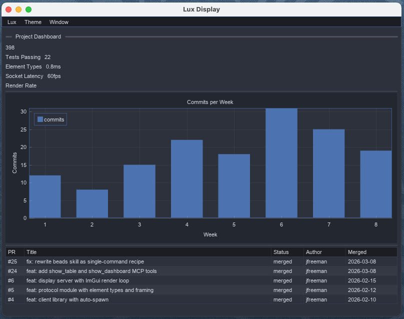

# lux

> A visual output surface for AI agents.

[](LICENSE)
[](https://github.com/punt-labs/lux/actions/workflows/test.yml)
[](https://pypi.org/project/punt-lux/)
[](https://pypi.org/project/punt-lux/)

Lux gives AI agents a window they can draw into. It runs an ImGui display server on the local machine, connected by Unix socket IPC. Agents send JSON element trees via MCP tools; the display renders them at 60fps. The protocol is the API surface --- if an agent can describe it as JSON, Lux renders it.

The design follows Smalltalk's Morphic model: every visible element is a composable, nestable object. Windows contain tabs, tabs contain groups, groups contain buttons and plots. The long-term goal is a live environment where the MCP server is the message bus and Lux is the rendering layer, with the agent as the programmer at the keyboard.

**Platforms:** macOS, Linux

**Stage:** alpha --- protocol is stable, published on PyPI as `punt-lux`

*A Claude Code plugin displaying a project issue board --- the agent reads JSONL, builds a filterable table with detail panel, and renders it in a single tool call. Filters and row selection run at 60fps with zero MCP round-trips.*


*The same list/detail pattern generalizes to any tabular data. Search, combo filters, pagination, and a detail panel --- all driven by a single `show_table()` call.*


*Dashboards compose metric cards, charts, and tables. `show_dashboard()` builds the layout from structured data --- no manual element positioning needed.*



## Quick Start

```bash
curl -fsSL https://raw.githubusercontent.com/punt-labs/lux/8aab4ad/install.sh | sh
```

Restart Claude Code twice. The Lux display window opens automatically when agents send visual output.

<details>
<summary>Manual install (if you already have uv)</summary>

```bash
uv tool install punt-lux
```

Then install the plugin via the marketplace:

```bash
claude plugin marketplace add punt-labs/claude-plugins
claude plugin install lux@punt-labs
```

</details>

<details>
<summary>Verify before running</summary>

```bash
curl -fsSL https://raw.githubusercontent.com/punt-labs/lux/8aab4ad/install.sh -o install.sh
shasum -a 256 install.sh
cat install.sh
sh install.sh
```

</details>

<details>
<summary>Run a demo</summary>

```bash
lux display &
uv run python demos/dashboard.py
```

Demos are in `demos/` --- each connects as a client and drives the display:

| Demo | What it shows |
|------|--------------|
| `interactive.py` | Sliders, checkboxes, combos, text inputs, color pickers |
| `containers.py` | Windows, tab bars, collapsing headers, groups |
| `dashboard.py` | Multi-window layout with draw canvases and live controls |
| `data_viz.py` | Tables, plots, progress bars, spinners, markdown |
| `menu_bar.py` | Custom menus, event handling, periodic refresh |

</details>

## Features

- **22 element kinds** --- text, buttons, images, sliders, checkboxes, combos, inputs, radios, color pickers, selectables, trees, tables, plots, progress bars, spinners, markdown, draw canvases, groups, tab bars, collapsing headers, windows, separators
- **Layout nesting** --- windows contain tab bars contain groups contain any element, arbitrarily deep
- **Incremental updates** --- `update` patches individual elements by ID without replacing the scene
- **Menu bar** --- built-in Lux/Theme/Window menus, plus agent-extensible custom menus via `set_menu`
- **Interaction events** --- button clicks, slider changes, menu selections queue as events the agent reads via `recv`
- **Auto-spawn** --- `LuxClient` starts the display server on first connection if it isn't running
- **Unix socket IPC** --- length-prefixed JSON frames, no HTTP overhead, no threads

## MCP Tools

Agents interact with Lux through eight MCP tools exposed by `lux serve`:

| Tool | What it does |
|------|-------------|
| `show(scene_id, elements)` | Replace the display with a new element tree |
| `show_table(scene_id, columns, rows)` | Display a filterable data table with optional detail panel |
| `show_dashboard(scene_id, ...)` | Display a dashboard with metric cards, charts, and a table |
| `update(scene_id, patches)` | Patch elements by ID (set fields or remove) |
| `set_menu(menus)` | Add custom menus to the menu bar |
| `set_theme(theme)` | Switch display theme (dark, light, classic, cherry) |
| `clear()` | Remove all content from the display |
| `ping()` | Round-trip latency check |
| `recv(timeout)` | Read the next interaction event (clicks, changes) |

## What It Looks Like

### Show text and a button

```json
{"tool": "show", "input": {
  "scene_id": "hello",
  "elements": [
    {"kind": "text", "id": "t1", "content": "Hello from the agent"},
    {"kind": "button", "id": "b1", "label": "Click me"}
  ]
}}
```

Returns `"ack:hello"`. When the user clicks the button:

```json
{"tool": "recv", "input": {"timeout": 5.0}}
```

Returns `"interaction:element=b1,action=click,value=True"`.

### Multi-window dashboard

```json
{"tool": "show", "input": {
  "scene_id": "dash",
  "elements": [
    {"kind": "window", "id": "w1", "title": "Controls", "x": 10, "y": 10,
     "children": [
       {"kind": "slider", "id": "vol", "label": "Volume", "value": 50}
     ]},
    {"kind": "window", "id": "w2", "title": "Chart", "x": 320, "y": 10,
     "children": [
       {"kind": "plot", "id": "p1", "title": "Trend",
        "series": [{"label": "y", "type": "line",
          "x": [1,2,3,4], "y": [10,20,15,25]}]}
     ]}
  ]
}}
```

### Update a single element

```json
{"tool": "update", "input": {
  "scene_id": "dash",
  "patches": [
    {"id": "vol", "set": {"value": 75}}
  ]
}}
```

## Element Kinds

| Category | Kinds |
|----------|-------|
| Display | `text`, `button`, `image`, `separator` |
| Interactive | `slider`, `checkbox`, `combo`, `input_text`, `radio`, `color_picker` |
| Lists | `selectable`, `tree` |
| Data | `table`, `plot`, `progress`, `spinner`, `markdown` |
| Canvas | `draw` (line, rect, circle, triangle, polyline, text, bezier) |
| Layout | `group`, `tab_bar`, `collapsing_header`, `window` |

All elements with an `id` support an optional `tooltip` field (string shown on hover).

## CLI Commands

| Command | What it does |
|---------|-------------|
| `lux display` | Start the display server (ImGui window) |
| `lux serve` | Start the MCP server (stdio transport) |
| `lux status` | Check if the display server is running |
| `lux version` | Print version |

## Architecture

```text
Agent (Claude Code)
  │ MCP (stdio)
  ▼
lux serve (FastMCP)
  │ Unix socket (JSON frames)
  ▼
lux display (ImGui + OpenGL)
  │ renders at 60fps
  ▼
Window on screen
```

The display server and MCP server are separate processes. The MCP server is a thin adapter that translates MCP tool calls into protocol messages sent over the Unix socket. The display server runs the ImGui render loop, polls the socket each frame via `select()` with zero timeout, and renders whatever scene the agent last sent.

Client code can also use `LuxClient` directly as a Python library, bypassing MCP. The demos do this.

## Documentation

[Architecture](docs/architecture.tex) |
[Design Log](DESIGN.md) |
[Changelog](CHANGELOG.md) |
[Contributing](CONTRIBUTING.md)

## Development

```bash
uv sync --extra dev            # Install dependencies
uv run ruff check .            # Lint
uv run ruff format --check .   # Check formatting
uv run mypy src/ tests/        # Type check (mypy)
uv run pyright                 # Type check (pyright)
uv run pytest                  # Test
```

## Acknowledgements

Lux is a thin orchestration layer. The rendering is done by [Dear ImGui](https://github.com/ocornut/imgui), Omar Cornut's immediate-mode GUI library. ImGui handles all the hard problems --- text layout, widget state, input handling, GPU rendering --- and does so in a single-pass retained-mode-free architecture that maps naturally to Lux's "send JSON, render this frame" model. The 60fps render loop, the composable widget tree, and the ability to drive a full UI from a socket with no threading are all consequences of ImGui's design.

Python bindings come from [imgui-bundle](https://github.com/pthom/imgui_bundle) by Pascal Thomet, which packages ImGui, ImPlot, and several other ImGui extensions into a single pip-installable wheel with complete type stubs. imgui-bundle is what makes "install one Python package, get a GPU-accelerated UI" possible.

[FastMCP](https://github.com/jlowin/fastmcp) provides the MCP server layer.

## License

MIT
