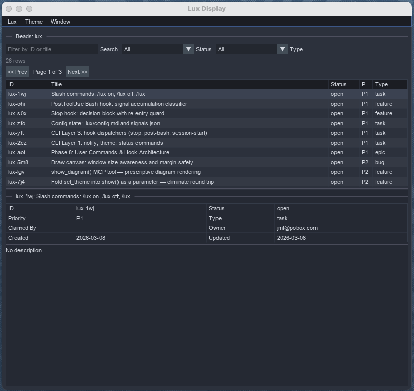
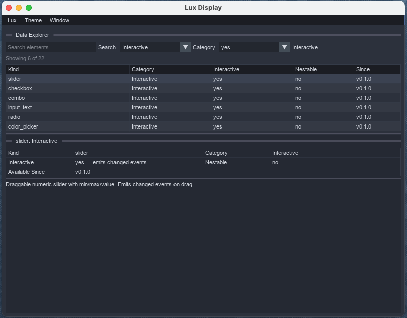
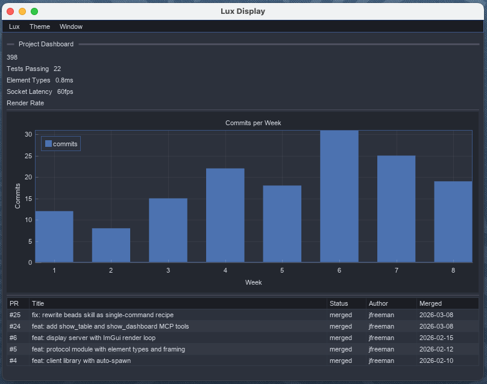

# lux

> A visual output surface for AI agents.

[](LICENSE)
[](https://github.com/punt-labs/lux/actions/workflows/test.yml)
[](https://pypi.org/project/punt-lux/)
[](https://pypi.org/project/punt-lux/)
[](prfaq.pdf)

Lux gives agents and apps a shared visual surface. The intended architecture is a hub/display split: clients send UI descriptions to `luxd`, the Hub owns authoritative element state and behavior, and the Display renders a replica of the current scene while forwarding user interactions back to the Hub.

The design draws on X11's client/server split and Smalltalk-style live introspection. MCP is one gateway into Lux, not the whole architecture. If you want the short version of the rewrite target, start with [`docs/architecture/target/target.md`](docs/architecture/target/target.md). If you need help navigating the docs, use [`docs/README.md`](docs/README.md). For the product direction, positioning, and risk assessment — the Working Backwards PR/FAQ — see [`prfaq.pdf`](prfaq.pdf).

**Platforms:** macOS, Linux

**Stage:** alpha --- protocol is stable, published on PyPI as `punt-lux`

*A Claude Code plugin displaying a project issue board --- the agent fetches live data from DoltDB via `bd list --json`, builds a filterable table with detail panel, and renders it in a single tool call. Filters and row selection run at 60fps with zero MCP round-trips.*



*The same list/detail pattern generalizes to any tabular data. Search, combo filters, pagination, and a detail panel --- all driven by a single `show_table()` call.*



*Dashboards compose metric cards, charts, and tables. `show_dashboard()` builds the layout from structured data --- no manual element positioning needed.*



## Quick Start

```bash
curl -fsSL https://raw.githubusercontent.com/punt-labs/lux/c6a817d6/install.sh | sh
```

Restart Claude Code twice. The Lux display window opens automatically when agents send visual output.

<details>
<summary>Manual install (if you already have uv)</summary>

```bash
uv tool install 'punt-lux[display]'
```

Then install the plugin via the marketplace:

```bash
claude plugin marketplace add punt-labs/claude-plugins
claude plugin install lux@punt-labs
```

</details>

<details>
<summary>Lightweight install (CLI and protocol types, no renderer)</summary>

If you only need the `lux` CLI and the JSON protocol element types --- enough to
drive a running luxd over its REST API and to build element trees in Python
--- install the base package:

```bash
uv add punt-lux
```

This pulls ~2 MB of lightweight deps. The 66 MB display stack (imgui-bundle, numpy, Pillow, PyOpenGL) is only needed to run the renderer (`lux display`) and is available via `punt-lux[display]`.

</details>

<details>
<summary>Verify before running</summary>

```bash
curl -fsSL https://raw.githubusercontent.com/punt-labs/lux/c6a817d6/install.sh -o install.sh
shasum -a 256 install.sh
cat install.sh
sh install.sh
```

</details>

<details>
<summary>Run a demo</summary>

```bash
lux display &
uv run python demos/dashboard.py
```

Demos are in `demos/` --- each connects as a client and drives the display:

| Demo | What it shows |
|------|--------------|
| `interactive.py` | Sliders, checkboxes, combos, text inputs, color pickers |
| `containers.py` | Windows, tab bars, collapsing headers, groups |
| `dashboard.py` | Multi-window layout with draw canvases and live controls |
| `data_viz.py` | Tables, plots, progress bars, spinners, markdown |
| `menu_bar.py` | Custom menus, event handling, periodic refresh |

</details>

## Features

- **25 element kinds** --- text, buttons (arrow, small), images, sliders, checkboxes, combos, inputs (text, number), radios, color pickers (alpha, full picker), selectables, trees, tables, plots, progress bars, spinners, markdown, draw canvases, modals, dialogs, groups, tab bars, collapsing headers, windows, separators
- **Frames** --- scenes target named frames (inner windows) via `frame_id`. Frames persist after disconnect, can be adopted by new clients, and support initial sizing (`frame_size`) and ImGui window flags (`frame_flags`)
- **Layout nesting** --- windows contain tab bars contain groups contain any element, arbitrarily deep
- **Incremental updates** --- `update` patches individual elements by ID without replacing the scene
- **Session menus** --- the menu bar shows one submenu per live session. A session registers a menu entry via `register_callback` from the connection it holds open to the Hub, and a click on that entry is pushed straight down that connection for the session to service from its own shell. The "Beads" entry each lux-enabled session's `lux-beads` applet registers is how the beads board reopens from the menu
- **Interaction handling** --- button clicks, slider changes, and menu clicks fire their handlers on the Hub (D21 remote dispatch); the raw event log is readable via `list_recent_events`. Hub handlers can `publish` app events that the agent reads via `recv`
- **Announce on arrival, repaint in place** --- a genuinely new scene raises and focuses its frame; updating an existing scene repaints it where it is. A minimized frame stays minimized, the focused frame keeps focus, and the selected tab stays selected --- the user controls what is front-most, not updates
- **Persistent tabs** --- each `show()` call opens a dismissable tab; same `scene_id` replaces content in-place. Users can close individual tabs
- **Themes** --- 11 themes via `set_theme`: `imgui_colors_dark`, `imgui_colors_light`, `imgui_colors_classic`, `darcula`, `darcula_darker`, `material_flat`, `photoshop_style`, `grey_flat`, `cherry`, `light_rounded`, `microsoft_style`
- **Auto-spawn** --- the Hub (luxd) starts the display renderer on first use if it isn't already running
- **Unix socket IPC** --- length-prefixed JSON frames, no HTTP overhead, no threads

## MCP Tools

Agents interact with Lux through the MCP tools `luxd` serves over its streamable-HTTP `/mcp` endpoint (the authoritative roster is pinned by a test; this table mirrors it):

| Tool | What it does |
|------|-------------|
| **Scene management** | |
| `show(scene_id, elements)` | Replace the display with a new element tree. Supports `frame_id`, `frame_size`, `frame_flags` for windowed frames |
| `show_table(scene_id, columns, rows)` | Display a filterable data table with optional detail panel |
| `show_dashboard(scene_id, ...)` | Display a dashboard with metric cards, charts, and a table |
| `update(scene_id, patches)` | Patch elements by ID (set fields or remove) |
| `clear()` | Remove the caller's scenes from the display |
| `clear_scene(scene_id)` | Clear one scene and blank its frame; unknown or unowned scenes are named errors, never a false "cleared" |
| **Communication** | |
| `ping()` | Round-trip latency check |
| `identify(kind, name, repo, agent)` | Declare who this session is so the Hub attributes the UI it installs |
| `recv()` | Take the next queued app event for this session (pub/sub) without blocking; returns `event:<topic>:<payload>` or `none` immediately. Poll on your own schedule. UI interactions are handled Hub-side, not delivered here |
| `set_menu(menus)` | Add custom menus to the menu bar |
| `register_callback(callback_id, label)` | Register a menu entry the calling connection owns; refused unless that connection holds luxd's listen leg, since clicks are delivered by push |
| `set_theme(theme)` | Switch display theme |
| **Configuration** | |
| `display_mode(repo)` | Read current display mode (`y`/`n`) for the caller's project --- pass the absolute project path |
| `set_display_mode(mode, repo)` | Set display mode for the caller's project --- pass the absolute project path |
| `set_window_settings(...)` | Configure opacity, font scale, decoration, idle FPS |
| `set_frame_state(frame_id, ...)` | Minimize or restore a frame |
| **Introspection** | |
| `inspect_scene(scene_id)` | Return element tree for a scene |
| `list_scenes()` | List all active scenes with metadata |
| `get_display_info()` | Display dimensions, frame count, client count |
| `get_window_settings()` | Current window configuration |
| `get_theme()` | Current theme name |
| `list_clients()` | Connected clients with names and scene counts |
| `list_menus()` | The menu bar, including the per-session callback submenus |
| `list_recent_events(count)` | Recent interaction events |
| `list_errors(count)` | Recent error log entries |
| **Pub/Sub (Agent Subscribe)** | |
| `subscribe(topic)` | Subscribe to a Hub-scoped app topic; delivered via `recv` |
| `unsubscribe(topic)` | Stop receiving a topic |
| `publish(topic, payload)` | Publish an app event to a Hub topic (separate from the UI observer mechanism) |

## What It Looks Like

### Show text and a button

```json
{"tool": "show", "input": {
  "scene_id": "hello",
  "elements": [
    {"kind": "text", "id": "t1", "content": "Hello from the agent"},
    {"kind": "button", "id": "b1", "label": "Click me"}
  ]
}}
```

Returns `"shown:hello"` immediately — the Hub has accepted the scene and its
background replicator paints it; no tool call ever waits on the display. A
button click fires its handler on the Hub (the agent does not poll for it). To observe interactions, read the introspection log:

```json
{"tool": "list_recent_events", "input": {"count": 5}}
```

A Hub-side handler can `publish` an app event that the agent then reads with
`recv` (see the Pub/Sub tools above). An element that declares
`"publish": ["my.topic"]` publishes what the user did — the event's kind, the
scene and element it landed on, and its own fields, such as a table selection's
`row_ids` and `anchor`. The full shape is in
[the library guide](docs/library.md#what-a-published-event-carries).

### Multi-window dashboard

```json
{"tool": "show", "input": {
  "scene_id": "dash",
  "elements": [
    {"kind": "window", "id": "w1", "title": "Controls", "x": 10, "y": 10,
     "children": [
       {"kind": "slider", "id": "vol", "label": "Volume", "value": 50}
     ]},
    {"kind": "window", "id": "w2", "title": "Chart", "x": 320, "y": 10,
     "children": [
       {"kind": "plot", "id": "p1", "title": "Trend",
        "series": [{"label": "y", "type": "line",
          "x": [1,2,3,4], "y": [10,20,15,25]}]}
     ]}
  ]
}}
```

### Update a single element

```json
{"tool": "update", "input": {
  "scene_id": "dash",
  "patches": [
    {"id": "vol", "set": {"value": 75}}
  ]
}}
```

## Element Kinds

| Category | Kinds |
|----------|-------|
| Display | `text`, `button` (arrow, small variants), `image`, `separator` |
| Interactive | `slider`, `checkbox`, `combo`, `input_text`, `input_number`, `radio`, `color_picker` (alpha, picker modes) |
| Lists | `selectable`, `tree` |
| Data | `table`, `plot`, `progress`, `spinner`, `markdown` |
| Canvas | `draw` (line, rect, circle, triangle, polyline, text, bezier) |
| Layout | `group`, `tab_bar`, `collapsing_header`, `window`, `modal`, `dialog` (modal confirm dialog with Hub-side handler dispatch) |

All elements with an `id` support an optional `tooltip` field (string shown on hover).

## CLI Commands

Noun-grouped: every operation is `lux <noun> <verb>`, matching the same
vocabulary the MCP tools and REST routes use. Every write accepts
`--as/--kind/--name/--repo/--agent` (per-invocation identity) and every
command accepts `--json/--verbose/--quiet`.

| Noun group | Verbs |
|---|---|
| `lux scene` | `show`, `update`, `clear`, `clear-all`, `inspect`, `ls`, `table`, `dashboard` |
| `lux frame` | `set-state` |
| `lux menu` | `ls`, `set` |
| `lux session` | `ls`, `inspect`, `identify` |
| `lux display` | `info`, `theme`, `mode`, `window`, `screenshot`, `serve` (the internal render-loop entry point luxd spawns, not an interactive verb) |
| `lux event` | `ls` |
| `lux error` | `ls` |
| `lux callback` | `register` |
| `lux hub` | `install`, `uninstall`, `start`, `stop`, `restart`, `status` (admin — process supervision, CLI-only) |

| Top-level singleton | What it does |
|---|---|
| `lux ping` | Ping the display through luxd; print round-trip time |
| `lux doctor` | Check installation health (Python, fonts, plugin) |
| `lux version` | Print version |
| `lux enable` | Enable visual output for this project |
| `lux disable` | Disable visual output for this project |
| `lux status` | Check if the display server is running |
| `lux install` | Install the Claude Code plugin via the marketplace |
| `lux uninstall` | Uninstall the Claude Code plugin |
| `lux beads` | Display the beads issue board via luxd's REST API (no LLM needed) — a bespoke app-specific convenience, not part of the noun-grouped vocabulary |
| `lux-beads` | The Beads applet: owns this session's Beads menu entry and services its clicks (launched by the plugin's session-start hook) |

`lux topic *` and `lux callback pending` are not exposed on the CLI: they
have no REST route by design (`tests/rest/test_app.py`'s `_MCP_ONLY`) —
delivery for both runs over the listen leg's push/drain, which a stateless
CLI request cannot bind to.

## Library (Python)

Python applications drive the Hub through `LuxRestClient`, the typed client of
`luxd` — the same validation, typing, and identity handling the CLI gets, with
no `[display]` extra required. Long-lived apps add `LuxHubClient` to receive
menu clicks and pub-sub events over a persistent connection; vox's music
player is the reference app built this way. The full guide, with working
examples, is [docs/library.md](docs/library.md).

## Architecture

```text
Agent or app
  │ MCP or direct Hub API
  ▼
luxd (Hub)
  │ authoritative state + introspection
  │ scene replicas + remote invocations
  ▼
lux display (ImGui + OpenGL)
  │ renders at 60fps
  ▼
Window on screen
```

The Hub is the single source of truth for element state, ownership, and handler dispatch. The Display is a rendering replica: it paints the current scene and forwards interactions back to the Hub, which runs the real handler and re-pushes updated state. MCP is one entry point, not the only one.

### How a session connects, and how its menu entries work

The bundled plugin connects Claude Code straight to `luxd`, with no per-session process in the path:

```json
{
  "mcpServers": {
    "lux": { "type": "http", "url": "http://127.0.0.1:8430/mcp" }
  }
}
```

Menu entries are a separate connection, and they belong to the session's **applets**. An applet is a small program — not a daemon, not part of `luxd` — that the plugin's session-start hook launches and that runs for the life of that session, in that session's repository and shell. `lux-beads` is the first.

An applet exists because a menu entry must launch in the time a user reads as instant, so the click has to be answered by something already running and already reachable: not a poll, and never a turn of the model. The applet registers its entry on its own connection, receives clicks pushed down it, and does the work itself — running `bd` from the repository's own shell and pushing the board to the Hub, which `luxd` cannot do from launchd with no `PATH`, no credentials, and no working directory.

It does not make you wait for data it could already have. Reading the issues is a query to a hosted database and it is the whole wait, so the applet loads a board as soon as its entry is registered and holds the board from every click after that. A click puts that board up immediately and reloads behind it; the fresh one replaces it in place, without taking focus. A reload that fails leaves the board standing and says why in the applet's log, because a board a few minutes old is worth more than a red message where the board was. Only a session that has not managed to load one yet sees "Loading issues…".

It leaves when its session does. Handed the session's process id at spawn, it checks every few seconds whether that process still exists and exits when it does not, so an applet cannot outlive its session even when the session is killed rather than closed. The Hub's lease sweeps the menu entry underneath that regardless.

`luxd` enforces the arrangement rather than trusting it: `register_callback` is refused unless the calling connection holds a listen leg, because a connection that could never be told its item was clicked must not own one. That is why the tool surface a session talks to owns no entries.

Setup and verification for a hand-configured direct connection are in [docs/library.md](docs/library.md).

## Documentation

[Docs Guide](docs/README.md) |
[Python Library Guide](docs/library.md) |
[Target Architecture](docs/architecture/target/target.md) |
[Current Architecture](docs/architecture/system.tex) |
[Design Log](DESIGN.md) |
[Changelog](CHANGELOG.md)

## Development

```bash
uv sync --extra display        # Install dependencies (dev group installs by default)
make check                     # Full gate: lint, format, mypy, pyright, tests, OO ratchet
make test-integration          # Integration tier
make restart                   # Rebuild, reinstall, restart luxd AND the display
```

`make check` is the commit gate — it runs ruff, mypy, pyright (via `npx`),
pytest, and the OO ratchet exactly as CI does.

The Claude Code plugin — its `plugin.json`, the `/lux` command, the session
hooks, and the skills — lives in `plugin/`, separate from the Python package in
`src/`. A marketplace install fetches only that directory, so load it for local
testing with `claude --plugin-dir plugin`. Installing the CLI (`uv tool install`,
`install.sh`, or `pip`) is unaffected: the wheel ships `src/punt_lux` and never
contained the plugin surface.

## Acknowledgements

Lux is a thin orchestration layer. The rendering is done by [Dear ImGui](https://github.com/ocornut/imgui), Omar Cornut's immediate-mode GUI library. ImGui handles all the hard problems --- text layout, widget state, input handling, GPU rendering --- and does so in a single-pass retained-mode-free architecture that maps naturally to Lux's "send JSON, render this frame" model. The 60fps render loop, the composable widget tree, and the ability to drive a full UI from a socket with no threading are all consequences of ImGui's design.

Python bindings come from [imgui-bundle](https://github.com/pthom/imgui_bundle) by Pascal Thomet, which packages ImGui, ImPlot, and several other ImGui extensions into a single pip-installable wheel with complete type stubs. imgui-bundle is what makes "install one Python package, get a GPU-accelerated UI" possible.

[FastMCP](https://github.com/jlowin/fastmcp) provides the MCP server layer.

## License

MIT
